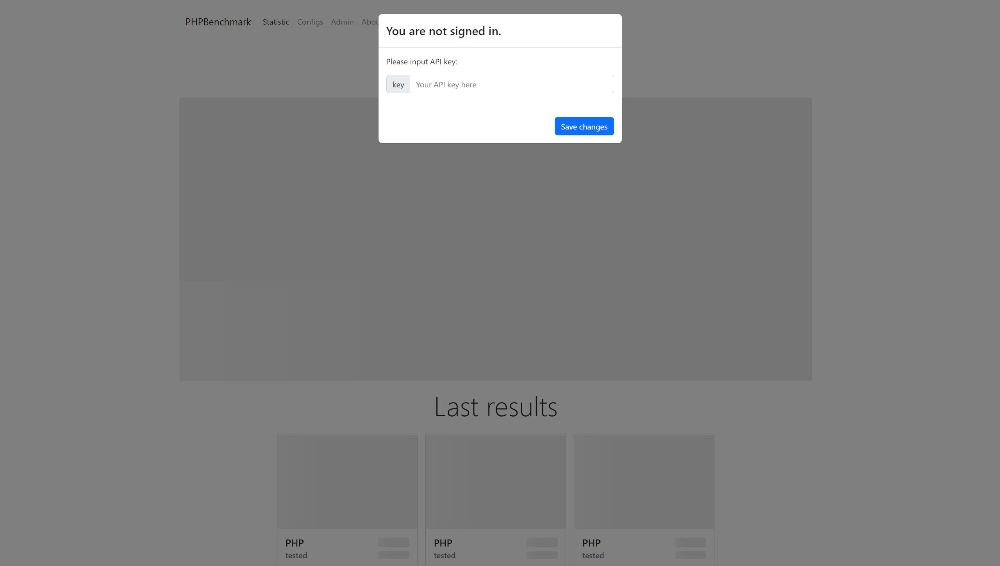
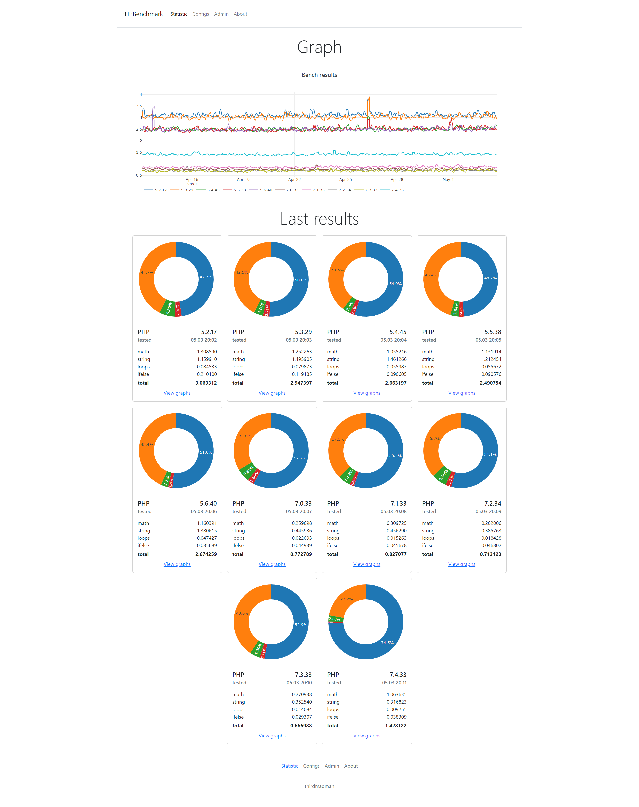

# php-benchmark-frontend

           


## Screenshots





## Description

This is the frontend part, SPA, of php benchmark system, which provides graphical representation of results php benchmark script execution by time.

This app can help hosting providers and systems administrators to monitor, indirectly, changes in performance of servers.

## Backend

This app uses backend from this repository:

<https://github.com/thirdmadman/php-benchmark-backend>

## Deploy

Firstly, you have to deploy backend part of this application.

To deploy frontend part of app use:

```npm run build```

then copy content of **/dist** folder into same folder as backed part.

## Usage

Open frontend part, simply following to your backend root path.

Example:

```text
Your backend url: http://benchmark01.somesite.com/api.php
Your frontend url will be: http://benchmark01.somesite.com
```

Copy API key from deploy of your backend part, and paste it into popup "You are not signed in." window.
